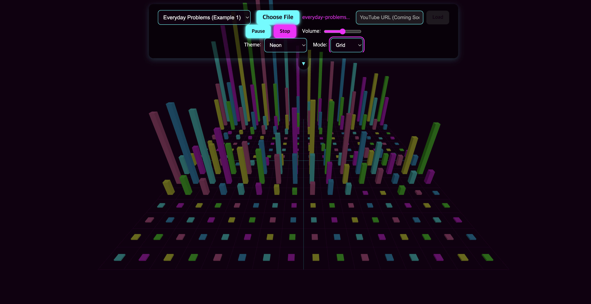

# Audio visualizer

Lightweight audo visualizer.



## How to use

### Set up

```shell
git clone ...
npm run install
npm run dev
```

### Visualize audio

1. Either select `Choose File` to upload an audio file to play, or use an audio file embeded as an example.
2. Click `Play`.